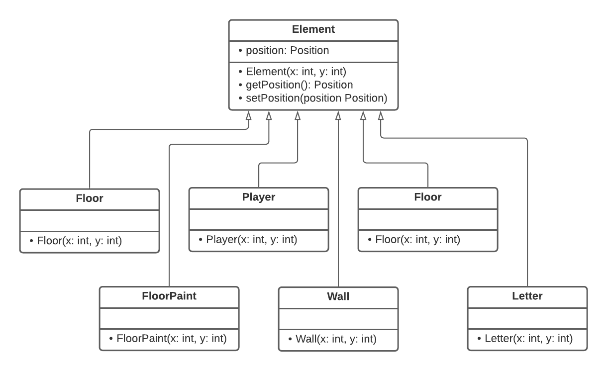

# Roller Splat
O jogo consiste num labirinto em que todos os espaços devem ser visitados por uma 
bola que deixa um rasto de tinta por onde passa. À medida que os níveis aumentam, os caminhos vão-se tornando mais difíceis de completar.

## Features
### Implementado
Modo "normal": apenas consiste no preenchimento de todos os espaços sem restrições. 
Um nível é completado quando todo o caminho é percorrido pela bola. 

Modo "invisível": bola não deixa rasto, exigindo uma maior concentração e memória do utilizador.

Modo "não repetir": exige que a bola passe por cada posição apenas uma vez.

Em todos os modos o utilizador pode pressionar a tecla 'r' para reiniciar o nível, ou
a tecla 'q' para voltar ao menu.

A partir do menu o utilizador pode escolher uma cor para o rasto de tinta
ou selecionar um dos niveis para jogar em qualquer modo. O botão exit do fecha 
o jogo.

### A implementar
Todos os modos foram implementados.

## Design
O nosso jogo recorre ao padrão de arquitetura MVC(model-view-controller), onde o model representa os dados,
a view é responsável por desenhar os objetos e o controller é responsável pelas ações do player e gerir o model e view.

### States
No caso dos estados de jogo, foi implementada uma classe abstrata State, esta escolha deve-se ao facto de ser necessário
implementar a mesma função de diferentes formas para classes derivadas diferentes e por ser necessário um construtor
para State. Desta são derivados os estados "Menu State", "Playing State", "WinningState" e "Losing State.
A partir destas classes podemos saber em que estado o jogo se encontra e agir de acordo com a situação, podendo o estado ser 
alterado e novos elementos correspondentes a outro estado ser desenhados no ecra.

### Elements
Uma vez que todos os elementos dos mapas exigem uma posição, recorremos a herança. Assim, as 
classes "Wall", "Player" e "Floor Paint" são derivadas da classe "Element".

### Level
LevelCreator lê os ficheiros "*.lvl" e separa todos os caracteres segundo o seu tipo e "Level" interpreta-os criando 
Elements de vários tipos.

### Viewer
Foram criados múltiplos "viewers" que implementam a interface "ElementViewer", tendo cada um a sua própria implementação
da função "draw".

### Controller

# Testing
- Testar bom funcionamento dos botões do menu  
- Testar se o player se movimenta corretamente  
- Testar se nível é terminado ao percorrer todos os espaços possíveis de visitar  
- Testar se não há mais formas de completar a jogada (a implementar)  

## Coverage

## Mutation Tests

## Code Smells
- Utilização dos mesmos níveis para todos os modos
- Criação de um viewer para cada cor que pinta o caminho percorrido
- Utilização de apenas um gui para todos os states

## Refactoring Suggestions
- Utilização de command pattern para encapsular a informação necessária para executar as ações do menu
- Utilização de factory pattern para desenhar os diferentes elementos dos viewers   

## Group info
 
Todos os membros do grupo colaboraram de igual modo para o desenvolvimento do projeto! :)

- up201907565 - Ana Luísa Marques (up201907565@up.pt)
- up201807626 - José Frederico Rodrigues (up201807626@up.pt)
- up201906784 - Margarida Raposo Oliveira (up201906784@up.pt)

